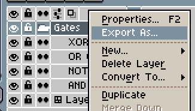
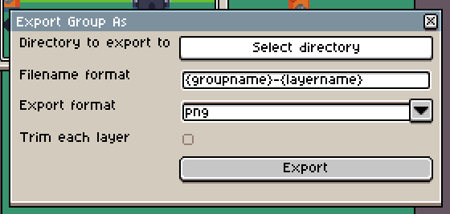

# aseprite-export-group

An [Aseprite](https://www.aseprite.org/) extension to export all layers in a group as separate sprites.

Inspired by (and partially based on) [PKGaspi's wonderful Export Layers plugin](https://github.com/PKGaspi/AsepriteScripts/tree/main). This repository extends the functionality to an Aseprite extension, allowing exporting directly via Aseprite's interface. Just right click the group you want to export!

## Installing
1. Download the latest extension file (`.aseprite-extension`) from the [Releases](https://github.com/aleokdev/aseprite-export-group/releases) tab.
2. In Aseprite, from the top bar, choose Edit > Preferences (or press Ctrl+K).
3. From within the extensions, navigate to the "Extensions" tab. If this tab does not exist, be sure Aseprite is up-to-date.
4. Press the 'Add Extension' button, and click on the downloaded file.
5. That's it! You should see an 'Export Group' extension under the 'Scripts' group.

## Tutorial
Right click any group you want to export. The options available are:
- *Directory to export to*: Exactly what it sounds like. Select the directory to place the children layers in. Due to limitations with Aseprite's dialog system, this is currently a file save dialog rather than a directory selection dialog, but it tries its best to appear to select a directory.
- *Filename format*: How to format the resulting filenames. `{groupname}` is replaced by the name of the group selected, and `{layername}` is replaced by the name of each of the layers. You can use `/` here to create folders. For instance, `{groupname}/{layername}` creates a folder inside the selected target directory with the group's name and places all exported layers inside using their name as filename.
- *Export format*: The export format and extension to use for each exported layer.
- *Trim each layer*: Whether to remove empty space around each exported layer or not.

**In order for this extension to work, the exported layer names must be unique within the document.**

## Want even more flexibility?
Most of this functionality is already built into Aseprite, just not in its interface. If you are an advanced user, you can use the [commandline](https://www.aseprite.org/docs/cli/#sheet) instead, which allows even more options such as exporting each frame individually, and more placeholders on the filename.